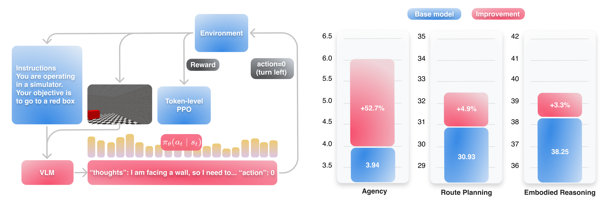

<h2 align="center"> Enhancing Vision-Language Model Training with Reinforcement Learning in Synthetic Worlds for Real-World Success </h2>

<div align="center">

`George Bredis` | `Stanislav Dereka` | `Viacheslav Sinii` | `Ruslan Rakhimov` | `Daniil Gavrilov`

[](https://arxiv.org/abs/2508.04280)

<p align="center">
  
</p>

</div>

## Overview

This repository contains the official implementation of **VL-DAC** (Vision-Language Decision-Making with Action Chunking), a framework for training Vision-Language Models (VLMs) using reinforcement learning in synthetic environments.

## Supported Environments

- **MiniWorld** - 3D navigation tasks
- **ALFWorld** - Text-based household tasks with visual observations  
- **WebShop** - Web-based shopping tasks
- **GymCards** - Card game reasoning tasks

## Supported Models

- **Qwen2-VL** (7B-Instruct)
- **Gemma3** 
- **LLaVA** (via model interface)

## Installation

```bash
git clone https://github.com/corl-team/VL-DAC.git
cd VL-DAC
pip install -e .
pip install -r requirements.txt
```

> **Note:** For environments with visual rendering (MiniWorld, ALFWorld), you need to have `xvfb` installed on your system:
> ```bash
> # Ubuntu/Debian
> sudo apt-get install xvfb
> 
> # Then run training with xvfb-run:
> xvfb-run -a python main_modular.py --config configs/miniworld_qwen2vl.yaml
> ```

### Environment-specific setup

For **MiniWorld**:
```bash
pip install "gymnasium[other]"
```

For **ALFWorld**:
```bash
pip install https://github.com/MarcCote/TextWorld/archive/handcoded_expert_integration.zip
pip install git+https://github.com/Natyren/alfworld.git
export ALFWORLD_DATA=~/alfworld-storage
alfworld-download
```

For **WebShop**:
```bash
git clone https://github.com/Natyren/WebShop.git
cd WebShop && source setup_mlc.sh
playwright install
```

## Configuration

Set required environment variables before training:

```bash
export WANDB_API_KEY=your_wandb_api_key          # For W&B logging
export HF_TOKEN=your_huggingface_token           # Optional: HuggingFace access
export AWS_ACCESS_KEY_ID=your_aws_key            # Optional: S3 uploads
export AWS_SECRET_ACCESS_KEY=your_aws_secret     # Optional: S3 uploads
export S3_ENDPOINT_URL=your_s3_endpoint          # Optional: S3 uploads
```

## Usage

### Training with config file

```bash
python main_modular.py --config configs/miniworld_qwen2vl.yaml
```

### Training with command-line arguments

```bash
python main_modular.py \
    --env-name MiniWorld-OneRoom-v0 \
    --model-path Qwen/Qwen2-VL-7B-Instruct \
    --use-wandb \
    --seed 42
```

### Multi-GPU training with DeepSpeed

```bash
accelerate launch --config_file scripts/config_zero2.yaml main.py \
    --modular \
    --config configs/miniworld_qwen2vl.yaml \
    --use-wandb
```

## Configuration Files

Pre-configured YAML files are available in `configs/`:

| Config | Environment | Model |
|--------|-------------|-------|
| `miniworld_qwen2vl.yaml` | MiniWorld | Qwen2-VL-7B |
| `alfworld_qwen2vl.yaml` | ALFWorld | Qwen2-VL-7B |
| `webshop_qwen2vl.yaml` | WebShop | Qwen2-VL-7B |
| `gymcards_qwen2vl.yaml` | GymCards | Qwen2-VL-7B |

## Project Structure

```
VL-DAC/
├── main.py                    # Legacy training script
├── main_modular.py            # Modular training script
├── configs/                   # YAML configuration files
├── scripts/                   # Shell scripts for training
└── a2c_ppo_acktr/
    ├── algo/                  # RL algorithms (PPO, A2C, REINFORCE)
    ├── environments/          # Environment wrappers
    ├── models/                # VLM model implementations
    ├── model_interface/       # Model interface utilities
    ├── trainer.py             # Main trainer class
    ├── config.py              # Configuration management
    └── storage.py             # Rollout storage
```

## Citation

If you find this work useful, please cite our paper:

```bibtex
@misc{bredis2025enhancingvisionlanguagemodeltraining,
      title={Enhancing Vision-Language Model Training with Reinforcement Learning in Synthetic Worlds for Real-World Success}, 
      author={George Bredis and Stanislav Dereka and Viacheslav Sinii and Ruslan Rakhimov and Daniil Gavrilov},
      year={2025},
      eprint={2508.04280},
      archivePrefix={arXiv},
      primaryClass={cs.LG},
      url={https://arxiv.org/abs/2508.04280}, 
}
```

## License

This project is licensed under the MIT License - see the [LICENSE](LICENSE) file for details.
